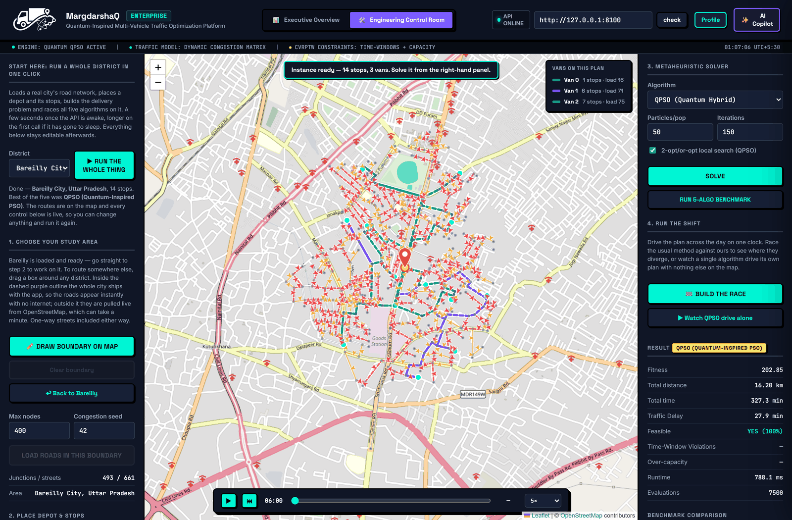
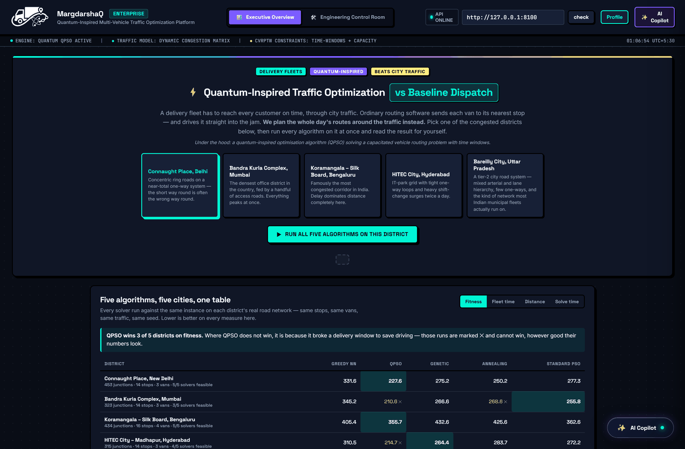
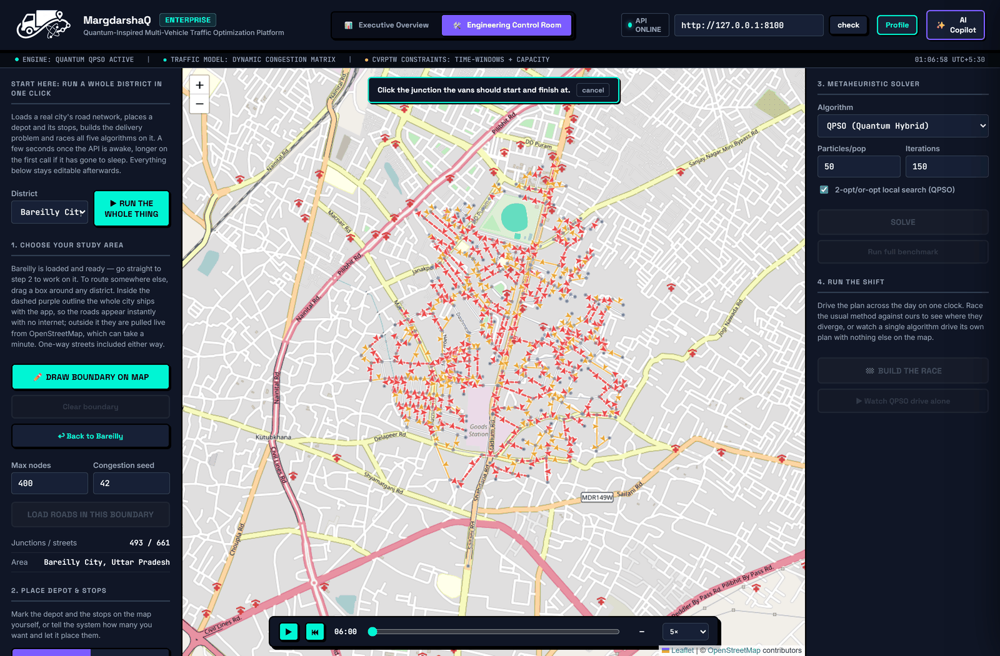

# MargdarshaQ — Quantum-Inspired Traffic Route Optimization

[](https://sih-26137.vercel.app)
[](https://sih26137.onrender.com/docs)
[](https://www.python.org/)
[](https://fastapi.tiangolo.com/)
[](https://leafletjs.com/)
[](tests/)
[](https://www.sih.gov.in/)

**A delivery fleet has to reach every customer on time, through city traffic.
Ordinary routing software sends each van to its nearest stop — and drives it
straight into the jam. This plans the whole day's routes around the traffic
instead.**

|  |  |
| :--- | :--- |
| **The problem** | Dispatching a fleet across a congested city is a Capacitated Vehicle Routing Problem with Time Windows (CVRPTW) — NP-hard, and made harder because a road's cost depends on *when* you drive it. Nearest-stop dispatch, which is what most municipal fleets actually run on, ignores both. |
| **The approach** | A quantum-inspired particle swarm optimiser (QPSO) searching a random-key encoding of the routing, hybridised with 2-opt/or-opt local search, over a time-dependent congestion model built on real OpenStreetMap road networks — one-way streets included. |
| **What it delivers** | On a 40-delivery, 9-van day it returns **5.8 hours of driver time**, at a measured cost of 108.6 km and 13.6 L more fuel. It is a trade, and [the report says so](data/impact_report.md) rather than quoting the flattering half. |
| **How we know** | Every claim is a re-runnable measurement: five algorithms on five real districts, plus an **exact solver** that proves the true optimum on small instances so "QPSO won" can be replaced by "QPSO was N% off optimal". |

---

## See it

The engineering console on a real district: the road network loaded from
OpenStreetMap, a depot and its stops placed, and all five algorithms raced on
the resulting delivery problem.



<details>
<summary>More screenshots — executive overview and the full console</summary>

The executive view: every solver against the same instance on each district's
real road network, same stops, same vans, same seed.



The engineering console, where the depot, the stops, the fleet, the traffic
model and the solver parameters are all editable.



</details>

> Screenshots are captured from the running app against a local backend.
> Regenerate them with `scripts/capture_screenshots.py`.

## Try it

| | URL | Hosted on |
| :--- | :--- | :--- |
| **Dashboard (UI)** | **https://sih-26137.vercel.app** | Vercel (static) |
| **Backend API** | **https://sih26137.onrender.com** · [Swagger docs](https://sih26137.onrender.com/docs) | Render (web service) |

Open the dashboard link — served from a deployed origin it points itself at the
live API automatically. Run it locally and it defaults to
`http://127.0.0.1:8000` instead, so local development is unaffected. Either way
the target is editable in the **API Base URL** field at the top.

> ⏱️ **First request may take 30–50 seconds.** The API runs on Render's free tier,
> which sleeps after ~15 minutes of inactivity and cold-starts on the next request.
> It is not broken — give the first call a moment. Warm it up by opening the
> [API docs](https://sih26137.onrender.com/docs) a minute before a demo.

## How good is it, really?

Comparing heuristics against each other answers "which guess is best", not "how
good is the best guess". For instances small enough to solve exactly,
[`app/core/exact_vrp.py`](app/core/exact_vrp.py) computes the provable optimum
under the same objective, and the benchmark table gains a gap column:

```
Algorithm                       Fitness   Feasible   Gap vs opt
Exact (optimal)                  194.30       True           --
QPSO (Quantum-Inspired PSO)      194.30       True       +0.00%
Genetic Algorithm                244.56       True      +25.87%
Standard PSO                     268.70       True      +38.29%
Simulated Annealing              293.96       True      +51.30%
Greedy Nearest-Neighbor          360.88       True      +85.74%
```

*9 customers, 2 vehicles, 60 iterations — QPSO reaches the optimum exactly.*

The same tool also shows where QPSO is *not* ahead: on an 8-customer instance at
60 iterations it sits 86% above optimal while GA is at 5.6%, and needs roughly
120 iterations before it closes to zero. Across the five shipped districts QPSO
wins 3 of 5 on fitness. Those numbers are in the repo because a benchmark you
can only quote when it flatters you is not a benchmark.

### Against the standard benchmark

Proving the optimum only reaches ten customers. Past that,
[`scripts/run_solomon_benchmark.py`](scripts/run_solomon_benchmark.py) runs
Solomon's 100-customer CVRPTW instances -- the set the field has been attacking
since 1987 -- and compares against their published best-known solutions. Full
results in [`data/solomon_results.md`](data/solomon_results.md):

| Instance | QPSO | Best known | Gap |
| :--- | ---: | ---: | ---: |
| RC201 | 1655.55 (14 vans) | 1406.94 (4 vans) | **+17.67%** |
| C101 | 1041.34 (14 vans) | 827.30 (10 vans) | **+25.87%** |
| C201 | 793.49 (7 vans) | 589.10 (3 vans) | **+34.70%** |

For a general-purpose metaheuristic with no VRPTW-specific operators, landing
within 18-35% of forty years of specialised work is a fair showing -- and it is
stated rather than implied.

The starker number is what happens to everything else at this scale: **GA,
Simulated Annealing and standard PSO return no feasible solution on any of the
six instances**, each burning 24-25 of the 25 available vehicles. Greedy is
always feasible and 59-219% off. On 100-customer instances QPSO is doing
something the other metaheuristics here are not, and this is the evidence.

Where QPSO is infeasible its distances are still close to best known (1762
against 1651 on R101), so it is finding short routes and breaking time windows
rather than failing to search -- which points at the penalty weights, not the
algorithm.


## Setup (on your machine)

```bash
cd sih26137
python -m venv venv
source venv/bin/activate        # Windows: venv\Scripts\activate
pip install -r requirements.txt
```

## Running the API

```bash
uvicorn app.main:app --reload --port 8000
```

Then open **http://127.0.0.1:8000/docs** for interactive Swagger UI — you can
generate a network, generate a VRP instance on it, solve it, and run the full
benchmark, all from the browser.

## API workflow

1. `POST /api/network/generate` → creates a synthetic city road network, returns `network_id`
2. `POST /api/vrp/generate` → creates a CVRPTW instance (customers, demands, time windows) on that network, returns `vrp_id`
3. `POST /api/vrp/solve` → solves the instance with one algorithm (`qpso`, `ga`, `sa`, `standard_pso`, or `greedy`)
4. `POST /api/benchmark/run` → solves with **all** algorithms and returns a side-by-side comparison (for your benchmarking/report deliverable)

Two additional endpoints support real-world data and the dashboard:
- `POST /api/network/from_osm` → loads a REAL city road network from OpenStreetMap (via `osmnx`) instead of a synthetic one — same `network_id` workflow after that
- `GET /api/network/{network_id}` / `GET /api/vrp/{vrp_id}` → refetch a previously generated network/instance

## Running the visualization dashboard

A standalone control-room style dashboard lives at `frontend/dashboard.html` —
network generation (synthetic or real OSM city), VRP instance generation,
solve, and full benchmark comparison, all with a live map and convergence chart.

1. Start the API (`uvicorn app.main:app --reload --port 8000`)
2. Serve the frontend folder (opening the file directly can hit browser
   fetch/CORS restrictions on some setups, so a tiny local server is safer):
   ```bash
   cd frontend
   python -m http.server 5500
   ```
3. Open **http://127.0.0.1:5500/dashboard.html**
4. Click "check" next to the API address field (defaults to
   `http://127.0.0.1:8000`) to confirm it's connected
5. Generate a network (synthetic, or type a real place name for OSM — e.g.
   "Connaught Place, New Delhi, India" — requires `osmnx` + internet), then
   generate a VRP instance on it, then Solve or Run full benchmark

The map auto-switches between a real Leaflet map (OSM networks) and a custom
SVG plot (synthetic networks, which don't have real lat/lon). Routes are drawn
along the actual road-network path (not straight lines) using the shortest
path each vehicle actually takes.

**Note:** this dashboard was built and syntax-checked in an environment
without a live backend to test against (no FastAPI/browser available in the
build sandbox) — the underlying business logic it depends on was validated
separately, but test the actual UI end-to-end first thing on your machine and
expect to fix small integration issues (e.g. CORS, port mismatches, edge
cases in map rendering for very large OSM networks).

## AI Assistant

The dashboard has an in-built assistant that explains routes, benchmark results
and the algorithm. It works with no configuration (local deterministic engine)
and gains free-text answers when an LLM key is set — free models via
[OpenRouter](https://openrouter.ai) by default.

Copy [`.env.example`](.env.example) to `.env` and set `OPENROUTER_API_KEY`.
Architecture and the no-fabrication rule are documented in
[docs/AI_ASSISTANT.md](docs/AI_ASSISTANT.md).

## Time-dependent traffic

Routes can be priced by **when** a vehicle departs, not by a single snapshot of
the network. Pass `time_dependent: true` to `/api/vrp/generate` (or
`generate_synthetic_vrp(..., time_dependent=True)`).

With it off — the default — a road costs the same at 09:00 and 14:00. With it
on, a travel-time matrix is precomputed per 30-minute bucket from the weekday
demand curve in [`app/core/traffic_profile.py`](app/core/traffic_profile.py),
and the solver routes around rush hour instead of averaging over it.

Measured on a 12-customer instance: the same leg costs **35 min off-peak and
63 min in the morning peak**. The optimiser picks different routes, and a plan
built without the clock is **27 min (5.8%) worse** once time-varying traffic is
applied to both.

It is opt-in because switching it on changes every travel time, and therefore
every previously published benchmark figure. Note the default operating day is
480 minutes from 06:00 (so 06:00-14:00): the morning peak falls inside it, the
evening peak does not. Widen `horizon` to include the evening peak.

The curve's shape is the standard commuter pattern; its amplitudes are a stated,
adjustable urban calibration rather than measured Delhi counts.

## Real-world impact numbers

Benchmark percentages don't tell a non-technical reader whether the result
matters. [`scripts/impact_report.py`](scripts/impact_report.py) converts measured
results into fuel, CO2 and driver hours, and writes a citable report:

```bash
python scripts/impact_report.py                 # synthetic sizes
python scripts/impact_report.py --real-city     # cached Delhi road network
```

Output goes to [`data/impact_report.md`](data/impact_report.md). Every
conversion factor lives in [`app/core/impact.py`](app/core/impact.py) — change
it there and re-run, and the dashboard, the report and the tests all follow.

Figures are signed: where the optimiser drives further to arrive sooner, the
report says so rather than showing a zero.

## Fast OSM lookups for a live demo

Drawing a boundary on the map queries the public Overpass API, which is shared
and rate-limited by IP — the same box measured 44s, then 169s, then a plain 502
inside one hour. For anything judged, run Overpass locally instead:

```bash
./setup-local-overpass.sh --region central-zone         # Bareilly default (~15-40 min)
./setup-local-overpass.sh --region india                # Full India import (~2+ hours)
python scripts/check_overpass.py --compare              # confirm it's being used
```

The setup script updates `.env` with `OSM_EXTRACT_URL` and
`OVERPASS_URL=http://localhost:12345/api/interpreter`, then starts the local
container. The same query returns in under a second. Leaving `OVERPASS_URL`
unset keeps the previous public-mirror behaviour, and a local instance that
isn't running falls back to it automatically rather than failing.

The import needs 8–16 GB RAM, up to 30 GB of disk, and anywhere from minutes to
two hours depending on how much of India you pull — **run it the day before the
event, not the morning of it.** Full runbook, extract-size tradeoffs and
hardware notes: [DEPLOYMENT.md](DEPLOYMENT.md#running-a-local-overpass-instance-for-live-demos).

## Deploying

Backend and frontend deploy to **different platforms** (Render for the backend,
Vercel/Netlify for the frontend) — see [DEPLOYMENT.md](DEPLOYMENT.md) for why and how.
Do not attempt to deploy the whole app to Vercel.

Both are already live — see [Live Demo](#-live-demo) above for the URLs.

## Running the standalone benchmark scripts (no API needed)

These generate the convergence and scalability plots directly to `data/`:

```bash
# Shortest-path formulation (simpler, for sanity-checking the algorithm)
python -m app.core.benchmark

# Full CVRPTW formulation (the actual deliverable)
python -m app.core.benchmark_vrp
```

## Project structure

```
sih26137/
├── app/
│   ├── core/
│   │   ├── graph_model.py            # Weighted traffic network + synthetic city generator
│   │   ├── qpso.py                   # QPSO for single-vehicle shortest path
│   │   ├── vrp_problem.py            # CVRPTW formulation (capacity + time windows)
│   │   ├── qpso_vrp.py               # QPSO + 2-opt/or-opt local-search hybrid for VRP (core deliverable)
│   │   ├── local_search.py           # 2-opt / or-opt operators
│   │   ├── exact_vrp.py              # Exact CVRPTW optimum for small instances (the yardstick)
│   │   ├── classical_baselines.py    # Dijkstra, A*, GA, SA, standard PSO (shortest-path)
│   │   ├── classical_baselines_vrp.py# GA, SA, standard PSO, Greedy NN (VRP)
│   │   ├── benchmark.py              # Benchmarking suite (shortest-path)
│   │   ├── benchmark_vrp.py          # Benchmarking suite (VRP) — convergence, scalability, robustness
│   │   ├── osm_network.py            # Real OpenStreetMap network loader (osmnx)
│   │   ├── overpass_network.py       # Direct Overpass loader for drawn boundaries (local instance or public mirrors)
│   │   └── store.py                  # In-memory store for API state (network_id/vrp_id -> objects)
│   ├── models/
│   │   └── schemas.py                # Pydantic request/response models
│   ├── api/
│   │   └── routes.py                 # FastAPI endpoints
│   └── main.py                       # FastAPI app entrypoint
├── scripts/
│   ├── build_osm_cache.py            # Pre-download a city network to data/networks/
│   ├── check_overpass.py             # Preflight: which Overpass endpoint will the demo use?
│   ├── measure_exact_vrp.py          # Runtime of the exact solver by instance size
│   └── capture_screenshots.py        # Regenerate the README screenshots from the running app
├── frontend/
│   └── dashboard.html                # Standalone visualization dashboard (map + charts + controls)
├── tests/                            # pytest suite: local search, encoding, jump cap, exact solver
├── docs/images/                      # README screenshots (see scripts/capture_screenshots.py)
├── data/                             # Generated plots land here
├── docker-compose.overpass.yml       # Local Overpass instance, for fast/reliable demo lookups
├── requirements.txt
└── README.md
```

## Key design notes / findings (for your report)

- **Encoding:** VRP is combinatorial, but QPSO/GA/PSO are continuous-space
  algorithms. We use a random-key encoding — one continuous gene per customer
  in `[0, n_vehicles)`; `floor()` picks the vehicle, the fractional part
  orders customers within that vehicle's route.
- **Why CVRPTW and not plain shortest-path:** plain shortest-path on a modest
  graph is trivially solved by every method (including Dijkstra exactly), so
  it can't demonstrate QPSO's advantages. Multi-vehicle VRP with capacity and
  time-window constraints is genuinely NP-hard, which is where quantum-inspired
  search shows real separation from classical baselines.
- **High-dimensional instability fix:** vanilla QPSO's `ln(1/u)` stochastic
  jump term is unbounded and, in high dimensions (many customers), an
  increasingly-likely single large jump on any dimension disrupts otherwise-good
  solutions. We cap this jump term (scaled down as dimensionality grows) to
  restore stable convergence at scale — see the docstring in `qpso_vrp.py`.
- **Memetic hybridization:** even after the jump-cap fix, vanilla QPSO trailed
  Standard PSO at 40–60 customers because it lacked any local refinement step.
  We periodically apply 2-opt/or-opt local search to the swarm's global best
  and reinject the improved solution (Lamarckian learning). This closed the
  gap completely — QPSO+local-search now wins at every tested scale (10–60
  customers), at the cost of higher runtime from the extra refinement passes.
- **Robustness:** single-seed comparisons between metaheuristics can be
  misleading due to randomness. `benchmark_vrp.py` includes a 5-seed robustness
  check reporting mean ± std, not just a single best-case number.
- **Bug found and fixed during development:** the initial or-opt implementation
  iterated over a stale snapshot of route indices while mutating the routes
  list mid-pass, which could silently duplicate a customer across two routes
  (or drop one). Building the visualization dashboard is what surfaced it —
  a duplicate customer was visible in a rendered route. Fixed by looking up
  each customer's current position fresh on every iteration instead of trusting
  stale indices (see `local_search.py`). Worth mentioning in your report as an
  example of why visualization matters for catching silent correctness bugs
  that pure fitness numbers can hide.

## License

**Not yet declared.** No `LICENSE` file is present, which by default means all
rights are reserved and nobody may reuse this code. If it is meant to be open,
add one.
